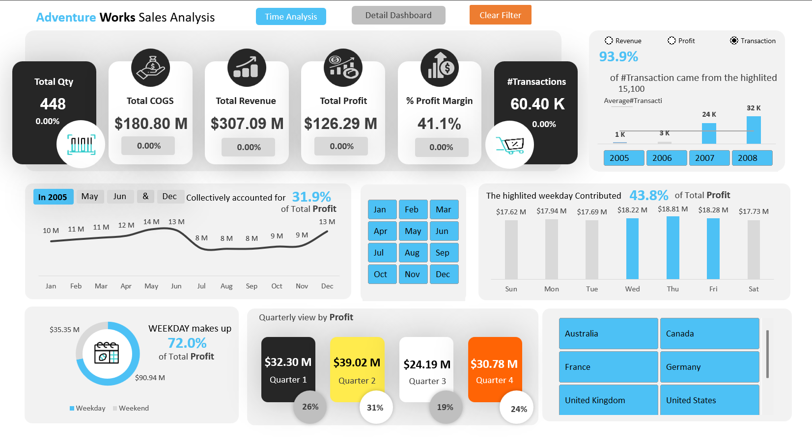
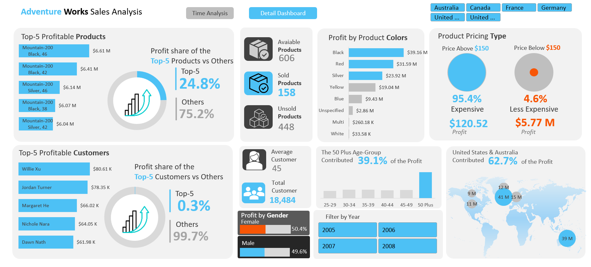

# 📊 Adventure Works Sales Analysis Dashboard

**Tool:** Microsoft Excel  
**Domain:** Retail / Sales Analytics  
**Project Type:** Interactive Dashboard | **Focus:** KPI Tracking, Profitability, Customer Insights

---

## 📌 Project Summary

This project showcases an interactive **Excel Dashboard** developed to analyze the sales performance of Adventure Works. The goal was to provide a 360° view of business health using key performance indicators (KPIs) and multi-dimensional data filters.

It helps business users and analysts:
- Monitor trends over time (monthly, quarterly, yearly)
- Understand product and customer profitability
- Refine pricing strategies
- Explore geographic insights for targeted expansion

---

## 🎯 Objectives

### 1. Performance Trends & KPI Comparison
- Analyze Year-over-Year (YoY) trends for **Revenue, Profit, COGS, Transactions, and Quantity Sold**
- Identify high-performing years and monthly/quarterly trends
- Evaluate weekday and special-period (e.g., promotional weeks) performance

### 2. Customer & Product Profitability
- Identify **Top 5 Profitable Products & Customers** and their contribution to total profit
- Segment performance by **Gender** and **Age Group**

### 3. Product & Pricing Optimization
- Analyze profitability by **Product Color**
- Compare **Premium vs Discount** product profitability

### 4. Geographic & Strategic Insights
- Visualize **Country-wise Profit Distribution** via custom map visuals
- Support market-specific strategies using region-based insights

---

## 🛠️ Tools & Features Used

| Component      | Description                                      |
|----------------|--------------------------------------------------|
| **Excel**       | Pivot Tables, Pivot Charts, Conditional Formatting |
| **Visuals**     | Card KPIs, Donut Charts, Bar Graphs, Line Charts, Custom Map |
| **Interactivity** | Slicers, Timelines for dynamic filtering         |
| **Design**      | Clean, responsive layout with intuitive visual storytelling |

---

## 📈 Sample Insights (from Dashboard)
- Weekdays contributed **72%** of total profit
- Premium-priced products brought in **95.4%** of the profit
- The **50+ age group** accounted for **39.1%** of profitability
- The **Top 5 products** generated **24.8%** of total profit
- **United States & Australia** alone contributed **62.7%** of overall profit

---

## 📎 Screenshots

Here are snapshots of the Excel dashboard showcasing different analysis views:

### 🔹 Overview Dashboard


### 🔹 Product, Customer & Demographic Analysis


---

## 📂 File Structure

```plaintext
📁 Adventure-Works-Sales-Analysis/
├── Dashboard_Screenshot_1.png
├── Dashboard_Screenshot_2.png
├── AdventureWorks_SalesDashboard.xlsx
├── README.md
